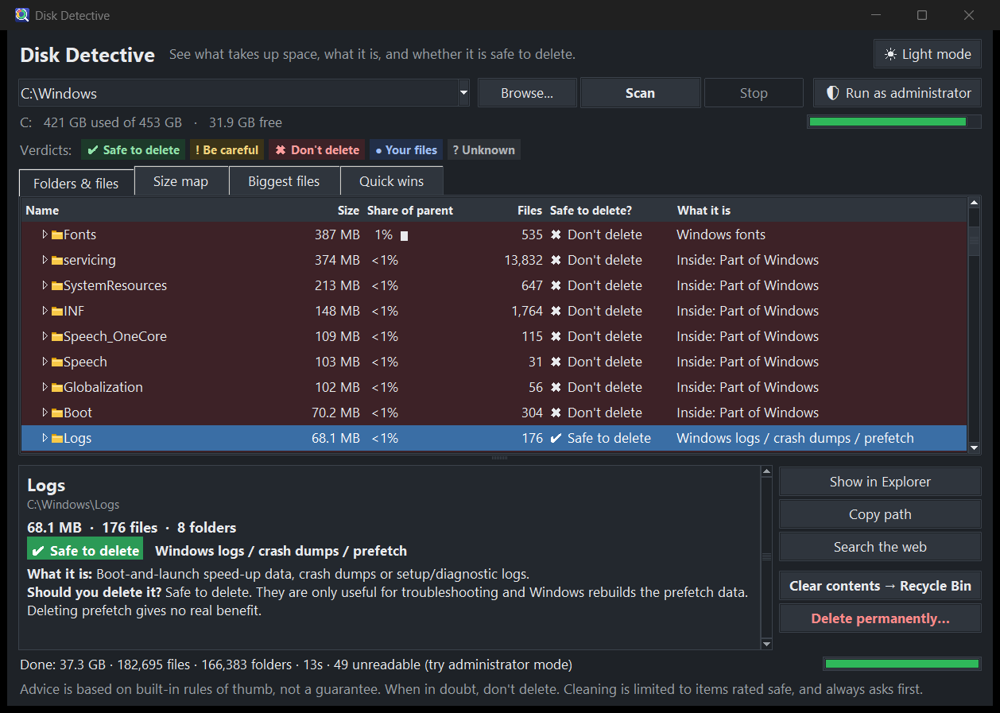

# Disk Detective

A Windows program that shows **how big** every file and folder is, **what it is**, and whether it is
**safe to delete** - and can clean up the safe stuff for you, through the Recycle Bin or permanently.



## Why

"Why is my disk full?" is easy to answer (WinDirStat, TreeSize...) but those tools stop at *sizes*. Disk Detective
adds the part that is actually hard: **"what is this folder, and can I get rid of it?"** It ships with a
knowledge base of ~70 Windows folder rules and ~25 file-type groups (caches, temp files, crash dumps, `WinSxS`,
`node_modules`, browser profiles, game launchers, Docker/WSL disks, Steam, ...) and gives every item a verdict.

## Features

* **Folders & files** - lazy-expanding tree with size, share of parent, file count, a colour-coded verdict and a
  plain-language explanation. Sortable columns.
* **Size map** - a treemap of the selected folder, coloured by verdict. Click to inspect, double-click to zoom in.
* **Biggest files** - the 500 largest files on the scanned drive/folder.
* **Quick wins** - every folder rated safe to delete, with the total space you could free (nested folders are
  counted once). Select some or all and either send them to the Recycle Bin or delete them permanently, in one go.
* **Light / dark theme** (follows Windows by default).
* Fast: a multi-threaded scanner reads a full `C:\` (about 1 million files) in roughly 30-40 s using about 120 MB.

| Verdict | Meaning |
|---|---|
| Safe to delete | Caches, temp files, logs, crash dumps, leftovers - the system or app rebuilds them |
| Be careful | Installed programs, app data, synced folders, VM disks - deleting may break something or lose data |
| Don't delete | Windows itself and protected system areas |
| Your files | Documents, pictures, downloads... - your call, nothing here is "junk" by default |
| Unknown | Not recognised - look inside, or use *Search the web* (only the item's *name* is sent) |

## Safety

* Two ways to clean, both **only for items rated safe** and **only after you confirm** (the dialog defaults to "No"):
  **Move to Recycle Bin** (restorable; the disk space is released when you empty the bin) and
  **Delete permanently** (red button, *cannot be undone*, frees the space immediately).
  For a folder, only its *contents* are removed - the folder stays, so programs that expect their Temp/Cache folder keep working.
* Permanent delete never follows junctions or symbolic links out of the folder (the link is removed, its target is
  not), clears read-only flags, and reports files that are in use instead of failing silently.
* **Credential guard:** a folder that contains saved logins, cookies, bookmarks or keys (`Login Data`, `Cookies`,
  `logins.json`, `key4.db`, `places.sqlite`, SSH keys, KeePass files...) is never offered and is refused even if
  its name looks like a cache - embedded browsers inside game launchers keep their sessions in cache-like folders.
  Your real Chrome/Firefox/Edge profiles are rated "be careful" and are never touched.
* Items rated "be careful", "don't delete", "your files" or "unknown" cannot be removed from inside the program at all.
* The verdicts are rules of thumb, not a guarantee. When in doubt, don't delete.

## Download / run

Build it yourself (see below) or run from source - Python 3.9+ with Tk (the normal python.org installer has it):

```
python diskdetective.py [folder]
```

**Run as administrator** (button in the app) gives a complete scan of `C:\`; without it Windows hides some system
folders.

## Build the .exe

```
build.bat
```

Creates `dist\DiskDetective.exe` (single file, about 11 MB) with PyInstaller in a temporary virtual environment.
The exe is unsigned, so Windows SmartScreen may warn the first time ("More info" -> "Run anyway").

## How it works

| File | Purpose |
|---|---|
| `diskdetective.py` | The window (Tkinter): tree, size map, tabs, cleaning flow, themes |
| `scanner.py` | Multi-threaded, read-only folder-size scanner; re-measures part of a scan after a cleanup |
| `knowledge.py` | The rules: what each folder/file type is and whether it is safe to delete. Add your own with `_r(...)` |
| `cleaner.py` | Recycle Bin move (Windows shell, "undo" enabled), link-safe permanent delete, and the credential guard |
| `treemap.py` | Squarified treemap layout |
| `cli.py` | Text report without a window: `python cli.py C:\ --depth 2` |
| `make_icon.py` | Draws the app icon with the standard library only |
| `test_knowledge.py` | Self-checks: `python test_knowledge.py` (includes a real Recycle Bin round trip and junction-safety checks on temp files) |

Notes: sizes are logical file sizes; online-only OneDrive files count as 0 bytes; junctions and symlinks are not
followed (nothing is counted twice); `WinSxS` is hard-linked to System32, so its apparent size is larger than the
space it really uses.

## Contributing rules

Found a folder that is mislabelled or missing? Add a rule in `knowledge.py` - first match wins, so put specific
rules above general ones - and a case in `test_knowledge.py`.
